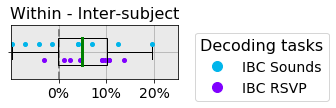
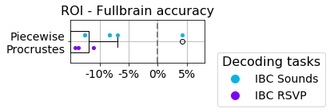

    .. -*- mode: rst -*-

.. image:: https://img.shields.io/badge/License-BSD%202--Clause-orange.svg
   :target: https://opensource.org/licenses/BSD-2-Clause
   :alt: BSD-2-Clause License

fmralign-benchmark-mockup
=========================

This repository contains code for reproducing results from the recent paper:

| *An empirical evaluation of functional alignment using inter-subject decoding.*
| Thomas Bazeille*, Elizabeth DuPre*, Jean-Baptiste Poline, & Bertrand Thirion.
| doi: 10.1101/2020.XX.XX.XXXXXX

Dependencies
------------

* `fmralign <https://parietal-inria.github.io/fmralign-docs/>`_
* `nibabel>=3.1 <http://nipy.org/nibabel/>`_
* `numpy>=1.18 <http://www.numpy.org/>`_
* `matplotlib <https://matplotlib.org/>`_
* `pandas <https://pandas.pydata.org/>`_
* `scipy <https://www.scipy.org/>`_
* `scikit-learn <http://scikit-learn.org/stable/>`_

Installation
------------

First, make sure you have installed all the dependencies listed above.
Then you can install fmralign-benchmark by running the following commands::

    git clone https://github.com/thomasbazeille/fmralign-benchmark-mockup
    cd fmralign-benchmark-mockup
    pip install .

To reproduce results from the Searchlight Hyperalignment method, you'll also
need to install ``PyMVPA``.
You can do so with the following commands, *assuming you are still in the
``fmralign-benchmark-mockup`` directory*::

    cd ..
    git clone https://github.com/PyMPVA/PyMVPA
    cd PyMVPA
    pip install -e .

You can confirm that both packages have installed correctly by opening a Python
terminal and running the following commands::

    import fmralignbench
    import mvpa2

Getting started
---------------

The folder ``experiments`` contains code to re-execute all of the main and
supplemental experiments included in the manuscript.

* ``experiment_1-2.py`` replicates the whole-brain and ROI-based level of analysis (170 CPU hours, 30+Go RAM)

* ``experiment_3.py`` replicates the qualitative comparison of alignment methods on IBC data (a few CPU hours, few hours, 30+Go RAM)
* ``supplementary_2-3.py`` replicates the supplemental experiments investigating the impact of parcellation and smoothing
* ``supplementary_4.py`` replicates the supplemental experiment comparing surface- and volume-based results for piecewise Procrustes (13Go download(high-resolution data), 45 CPU hours, 60Go RAM)

Replication of supplementary results

|pic1| any text |pic2|

